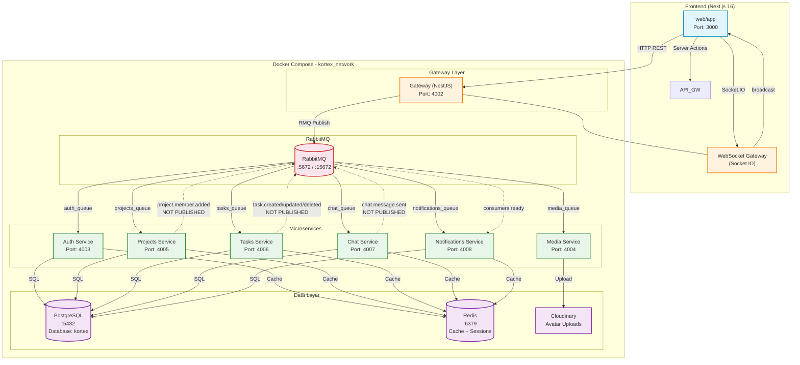

# Kortex - Arquitetura do Sistema

```mermaid
graph TB
    subgraph Client["Frontend (Next.js 16)"]
        direction TB
        FE["web/app<br/>Port: 3000"]
        FE -->|"Server Actions"| API_GW
        FE -->|"Socket.IO"| WS_GW
    end

    subgraph Docker["Docker Compose - kortex_network"]
        direction TB

        subgraph GatewayLayer["Gateway Layer"]
            GW["Gateway (NestJS)<br/>Port: 4002"]
            WS_GW["WebSocket Gateway<br/>(Socket.IO)"]
            GW --- WS_GW
        end

        subgraph RMQ["RabbitMQ"]
            MQ[("RabbitMQ<br/>:5672 / :15672")]
        end

        subgraph Microservices["Microservices"]
            AUTH_SVC["Auth Service<br/>Port: 4003"]
            MEDIA_SVC["Media Service<br/>Port: 4004"]
            PROJECTS_SVC["Projects Service<br/>Port: 4005"]
            TASKS_SVC["Tasks Service<br/>Port: 4006"]
            CHAT_SVC["Chat Service<br/>Port: 4007"]
            NOTIF_SVC["Notifications Service<br/>Port: 4008"]
        end

        subgraph DataLayer["Data Layer"]
            PG[("PostgreSQL<br/>:5432<br/>Database: kortex")]
            REDIS[("Redis<br/>:6379<br/>Cache + Sessions")]
            CLOUDINARY["Cloudinary<br/>Avatar Uploads"]
        end
    end

    %% Client -> Gateway
    FE -->|"HTTP REST"| GW
    GW -->|"RMQ Publish"| MQ

    %% RabbitMQ -> Microservices
    MQ -->|"auth_queue"| AUTH_SVC
    MQ -->|"media_queue"| MEDIA_SVC
    MQ -->|"projects_queue"| PROJECTS_SVC
    MQ -->|"tasks_queue"| TASKS_SVC
    MQ -->|"chat_queue"| CHAT_SVC
    MQ -->|"notifications_queue"| NOTIF_SVC

    %% Microservices -> Data
    AUTH_SVC -->|"SQL"| PG
    AUTH_SVC -->|"Cache"| REDIS
    MEDIA_SVC -->|"Upload"| CLOUDINARY
    PROJECTS_SVC -->|"SQL"| PG
    PROJECTS_SVC -->|"Cache"| REDIS
    TASKS_SVC -->|"SQL"| PG
    TASKS_SVC -->|"Cache"| REDIS
    CHAT_SVC -->|"SQL"| PG
    CHAT_SVC -->|"Cache"| REDIS
    NOTIF_SVC -->|"SQL"| PG
    NOTIF_SVC -->|"Cache"| REDIS

    %% WebSocket
    WS_GW -->|"broadcast"| FE

    %% Event Bus (missing publishers - dashed)
    CHAT_SVC -.->|"chat.message.sent<br/>NOT PUBLISHED"| MQ
    TASKS_SVC -.->|"task.created/updated/deleted<br/>NOT PUBLISHED"| MQ
    PROJECTS_SVC -.->|"project.member.added<br/>NOT PUBLISHED"| MQ
    MQ -.->|"consumers ready"| NOTIF_SVC

    classDef client fill:#e1f5fe,stroke:#0288d1,stroke-width:2px
    classDef gateway fill:#fff3e0,stroke:#f57c00,stroke-width:2px
    classDef rmq fill:#fce4ec,stroke:#c62828,stroke-width:2px
    classDef service fill:#e8f5e9,stroke:#388e3c,stroke-width:2px
    classDef data fill:#f3e5f5,stroke:#7b1fa2,stroke-width:2px
    classDef missing fill:#fff,stroke:#999,stroke-dasharray:5 5,stroke-width:1px

    class FE client
    class GW,WS_GW gateway
    class MQ rmq
    class AUTH_SVC,MEDIA_SVC,PROJECTS_SVC,TASKS_SVC,CHAT_SVC,NOTIF_SVC service
    class PG,REDIS,CLOUDINARY data
```
