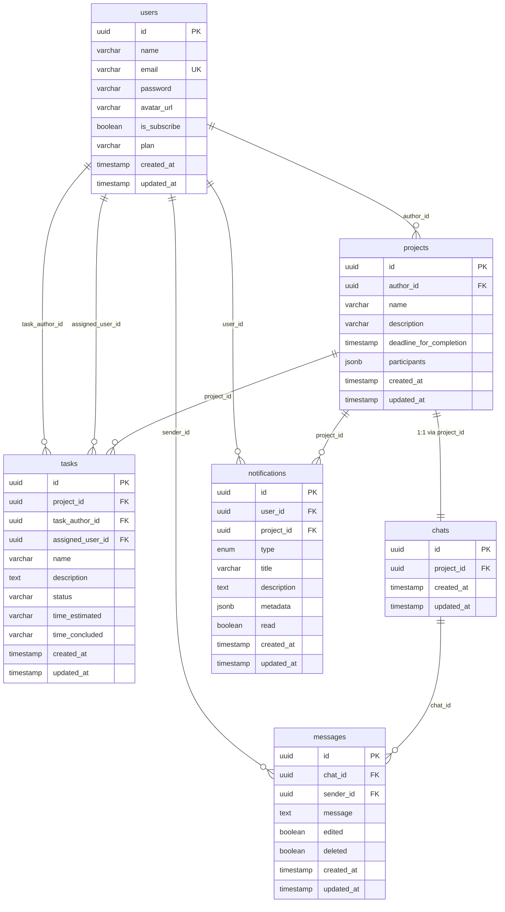

# Kortex - Diagrama Entidade-Relacionamento (ER)

```mermaid
erDiagram
    users {
        uuid id PK
        varchar name
        varchar email UK
        varchar password
        varchar avatar_url
        boolean is_subscribe
        varchar plan
        timestamp created_at
        timestamp updated_at
    }

    projects {
        uuid id PK
        uuid author_id FK
        varchar name
        varchar description
        timestamp deadline_for_completion
        jsonb participants
        timestamp created_at
        timestamp updated_at
    }

    tasks {
        uuid id PK
        uuid project_id FK
        uuid task_author_id FK
        uuid assigned_user_id FK
        varchar name
        text description
        varchar status
        varchar time_estimated
        varchar time_concluded
        timestamp created_at
        timestamp updated_at
    }

    chats {
        uuid id PK
        uuid project_id FK
        timestamp created_at
        timestamp updated_at
    }

    messages {
        uuid id PK
        uuid chat_id FK
        uuid sender_id FK
        text message
        boolean edited
        boolean deleted
        timestamp created_at
        timestamp updated_at
    }

    notifications {
        uuid id PK
        uuid user_id FK
        uuid project_id FK
        enum type
        varchar title
        text description
        jsonb metadata
        boolean read
        timestamp created_at
        timestamp updated_at
    }

    %% Relationships
    users ||--o{ projects : "author_id"
    users ||--o{ tasks : "task_author_id"
    users ||--o{ tasks : "assigned_user_id"
    users ||--o{ messages : "sender_id"
    users ||--o{ notifications : "user_id"

    projects ||--|| chats : "1:1 via project_id"
    projects ||--o{ tasks : "project_id"
    projects ||--o{ notifications : "project_id"

    chats ||--o{ messages : "chat_id"

    %% Note: participants is JSONB array, not a FK
    %% participants stores: [{ userId, role, joinedAt }]
```
