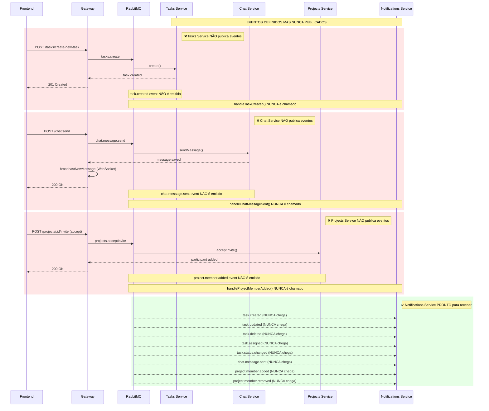

# Kortex - Fluxo de Eventos (O que falta conectar)

```mermaid
sequenceDiagram
    participant Client as Frontend
    participant GW as Gateway
    participant MQ as RabbitMQ
    participant Tasks as Tasks Service
    participant Chat as Chat Service
    participant Projects as Projects Service
    participant Notif as Notifications Service

    Note over Tasks,Notif: EVENTOS DEFINIDOS MAS NUNCA PUBLICADOS

    rect rgb(255, 230, 230)
        Note right of Tasks: ❌ Tasks Service NÃO publica eventos
        Client->>GW: POST /tasks/create-new-task
        GW->>MQ: tasks.create
        MQ->>Tasks: create()
        Tasks-->>GW: task created
        GW-->>Client: 201 Created
        Note over Tasks,MQ: task.created event NÃO é emitido
        Note over MQ,Notif: handleTaskCreated() NUNCA é chamado
    end

    rect rgb(255, 230, 230)
        Note right of Chat: ❌ Chat Service NÃO publica eventos
        Client->>GW: POST /chat/send
        GW->>MQ: chat.message.send
        MQ->>Chat: sendMessage()
        Chat-->>GW: message saved
        GW->>GW: broadcastNewMessage (WebSocket)
        GW-->>Client: 200 OK
        Note over Chat,MQ: chat.message.sent event NÃO é emitido
        Note over MQ,Notif: handleChatMessageSent() NUNCA é chamado
    end

    rect rgb(255, 230, 230)
        Note right of Projects: ❌ Projects Service NÃO publica eventos
        Client->>GW: POST /projects/:id/invite (accept)
        GW->>MQ: projects.acceptInvite
        MQ->>Projects: acceptInvite()
        Projects-->>GW: participant added
        GW-->>Client: 200 OK
        Note over Projects,MQ: project.member.added event NÃO é emitido
        Note over MQ,Notif: handleProjectMemberAdded() NUNCA é chamado
    end

    rect rgb(230, 255, 230)
        Note right of Notif: ✅ Notifications Service PRONTO para receber
        MQ-->>Notif: task.created (NUNCA chega)
        MQ-->>Notif: task.updated (NUNCA chega)
        MQ-->>Notif: task.deleted (NUNCA chega)
        MQ-->>Notif: task.assigned (NUNCA chega)
        MQ-->>Notif: task.status.changed (NUNCA chega)
        MQ-->>Notif: chat.message.sent (NUNCA chega)
        MQ-->>Notif: project.member.added (NUNCA chega)
        MQ-->>Notif: project.member.removed (NUNCA chega)
    end
```
