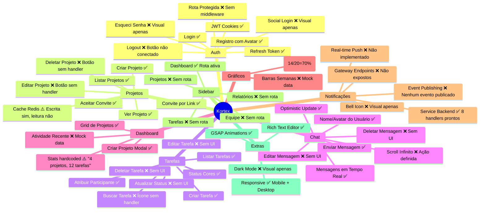

# Kortex - Status das Funcionalidades

```mermaid
mindmap
  root((Kortex))
    Auth
      Login ✅
      Registro com Avatar ✅
      JWT Cookies ✅
      Refresh Token ✅
      Logout ❌ Botão não conectado
      Rota Protegida ❌ Sem middleware
      Social Login ❌ Visual apenas
      Esqueci Senha ❌ Visual apenas
    Projetos
      Listar Projetos ✅
      Criar Projeto ✅
      Ver Projeto ✅
      Convite por Link ✅
      Aceitar Convite ✅
      Editar Projeto ❌ Botão sem handler
      Deletar Projeto ❌ Botão sem handler
      Cache Redis ⚠️ Escrita sim, leitura não
    Tarefas
      Listar Tarefas ✅
      Criar Tarefa ✅
      Status Cores ✅
      Atribuir Participante ✅
      Editar Tarefa ❌ Sem UI
      Deletar Tarefa ❌ Sem UI
      Atualizar Status ❌ Sem UI
      Buscar Tarefa ❌ Ícone sem handler
    Chat
      Enviar Mensagem ✅
      Mensagens em Tempo Real ✅
      Nome/Avatar do Usuário ✅
      Optimistic Update ✅
      Editar Mensagem ❌ Sem UI
      Deletar Mensagem ❌ Sem UI
      Scroll Infinito ❌ Ação definida
    Dashboard
      Grid de Projetos ✅
      Criar Projeto Modal ✅
      Stats hardcoded ⚠️ "4 projetos, 12 tarefas"
      Atividade Recente ❌ Mock data
    Gráficos
      Donut Tarefas ❌ Mock (14/20=70%)
      Barras Semanas ❌ Mock data
    Notificações
      Bell Icon ❌ Visual apenas
      Service Backend ✅ 8 handlers prontos
      Gateway Endpoints ❌ Não expostos
      Event Publishing ❌ Nenhum evento publicado
      Real-time Push ❌ Não implementado
    Sidebar
      Dashboard ✅ Rota ativa
      Projetos ❌ Sem rota
      Tarefas ❌ Sem rota
      Equipe ❌ Sem rota
      Relatórios ❌ Sem rota
    Extras
      Dark Mode ❌ Visual apenas
      Responsive ✅ Mobile + Desktop
      GSAP Animations ✅
      Rich Text Editor ✅
```
